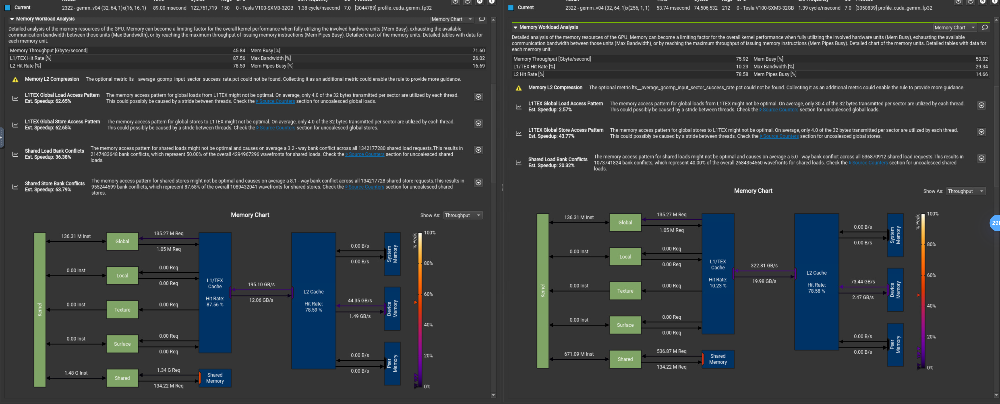
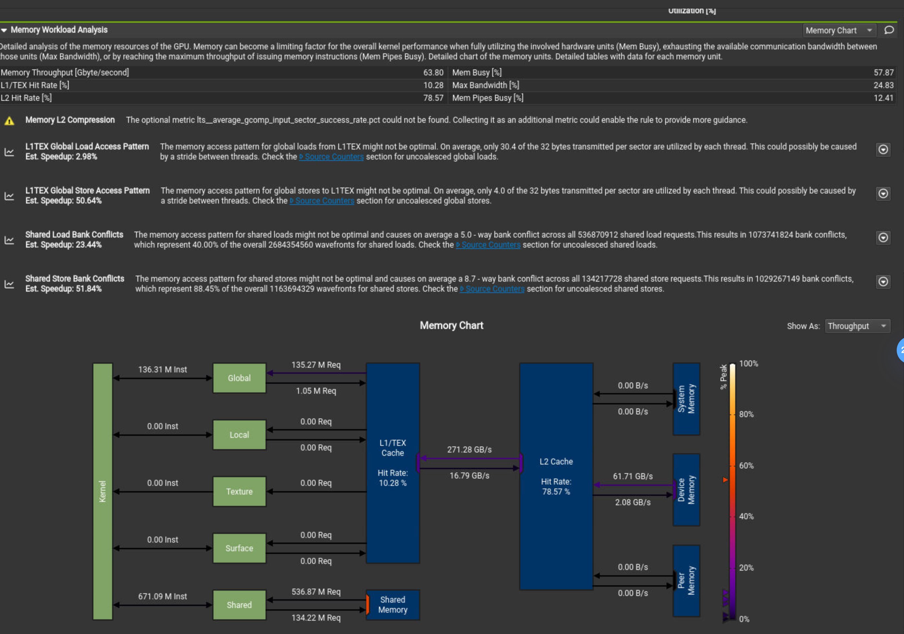

# GEMM CUDA Optimization

This project is based on the [Leimao's GEMM optimization](https://github.com/leimao/CUDA-GEMM-Optimization.git). 
The project uses the execution and timing structure of Leimao's realization. And the project contains three parts:
1. Replicate GEMM according to [Leimao's GEMM optimization blog](https://leimao.github.io/article/CUDA-Matrix-Multiplication-Optimization).
2. **New**: Realize the FP8 GEMM
3. **New**: Realize the multiple GPUs GEMM

# Timeline:

- [ ] Finish the first part before Mar.1 2025.
- [ ] Finish the third part before Mar.7 2025.

# Log

- [ ] Use nsight to analyse the memory coalescing.
- [ ] Profile v02.4
- [ ] Profile v04.4
- [ ] Profile v05.2

## Phase I

### V00

```bash
Device Name: Tesla V100-SXM3-32GB
Memory Size: 31.7394 GB
Peak Bandwitdh: 980.992 GB/s

Matrix Size: M = 4096 N = 4096 K = 4096
Matrix A: 4096 x 4096 Leading Dimension Size = 4096
Matrix B: 4096 x 4096 Leading Dimension Size = 4096
Matrix C: 4096 x 4096 Leading Dimension Size = 4096

Custom GEMM Kernel V00
cuBLAS GEMM Kernel Performance
Latency: 12.1866 ms
Effective Bandwidth: 16.5203 GB/s
Effective TFLOPS: 11.2779 TFLOPS
Custom GEMM Kernel Performance
Latency: 771.75 ms
Effective Bandwidth: 0.26087 GB/s
Effective TFLOPS: 0.178087 TFLOPS
Custom GEMM VS cuBLAS GEMM Performance: 1.57909%
```

### v01

In this section, ...

```bash
Custom GEMM Kernel V01
cuBLAS GEMM Kernel Performance
Latency: 12.1815 ms
Effective Bandwidth: 16.5272 GB/s
Effective TFLOPS: 11.2826 TFLOPS
Custom GEMM Kernel Performance
Latency: 77.2659 ms
Effective Bandwidth: 2.60563 GB/s
Effective TFLOPS: 1.77878 TFLOPS
Custom GEMM VS cuBLAS GEMM Performance: 15.7657%
```


### v02

#### v02.1
```bash
Device Name: Tesla V100-SXM3-32GB
Memory Size: 31.7394 GB
Peak Bandwitdh: 980.992 GB/s

Matrix Size: M = 4096 N = 4096 K = 4096
Matrix A: 4096 x 4096 Leading Dimension Size = 4096
Matrix B: 4096 x 4096 Leading Dimension Size = 4096
Matrix C: 4096 x 4096 Leading Dimension Size = 4096

Custom GEMM Kernel V02
cuBLAS GEMM Kernel Performance
Latency: 12.1795 ms
Effective Bandwidth: 16.53 GB/s
Effective TFLOPS: 11.2845 TFLOPS
Custom GEMM Kernel Performance
Latency: 42.7428 ms
Effective Bandwidth: 4.71019 GB/s
Effective TFLOPS: 3.21549 TFLOPS
Custom GEMM VS cuBLAS GEMM Performance: 28.4948%

Matrix Size: M = 8192 N = 4096 K = 4096
Matrix A: 8192 x 4096 Leading Dimension Size = 4096
Matrix B: 4096 x 4096 Leading Dimension Size = 4096
Matrix C: 8192 x 4096 Leading Dimension Size = 4096

Custom GEMM Kernel V02
cuBLAS GEMM Kernel Performance
Latency: 23.7763 ms
Effective Bandwidth: 14.1126 GB/s
Effective TFLOPS: 11.561 TFLOPS
Custom GEMM Kernel Performance
Latency: 85.3269 ms
Effective Bandwidth: 3.93246 GB/s
Effective TFLOPS: 3.22147 TFLOPS
Custom GEMM VS cuBLAS GEMM Performance: 27.8649%
```

Partition the matrix A and matrix B into tiles. While in version 02.1, we only partition the matrices once. And there is a bug in the program: the size of M, N, K tiles can't be changed. This bug will be fixed in version 02.2

#### v02.2
In version 02.2, we improve the program so that the we can change the size of K tiles. We improve the data transmission from global memory to shared memory.

```
Device Name: Tesla V100-SXM3-32GB
Memory Size: 31.7394 GB
Peak Bandwitdh: 980.992 GB/s

Matrix Size: M = 8192 N = 8192 K = 8192
Matrix A: 8192 x 8192 Leading Dimension Size = 8192
Matrix B: 8192 x 8192 Leading Dimension Size = 8192
Matrix C: 8192 x 8192 Leading Dimension Size = 8192

Custom GEMM Kernel V02
cuBLAS GEMM Kernel Performance
Latency: 94.6739 ms
Effective Bandwidth: 8.50611 GB/s
Effective TFLOPS: 11.6137 TFLOPS
Custom GEMM Kernel Performance
Latency: 362.553 ms
Effective Bandwidth: 2.22121 GB/s
Effective TFLOPS: 3.03269 TFLOPS
Custom GEMM VS cuBLAS GEMM Performance: 26.1131%
```

#### v02.3

We move the `load_data_from_global_memory_to_shared_memory` part into `cuda_gemm_utils.cuh` as a function.

#### v02.4

We realized the `load_data_from_global_memory_to_shared_memory_vectorized` by using `int4` type in CUDA. The performance is much lower than normal memory fetching method. 
```bash
Matrix Size: M = 4096 N = 4096 K = 4096
Matrix A: 4096 x 4096 Leading Dimension Size = 4096
Matrix B: 4096 x 4096 Leading Dimension Size = 4096
Matrix C: 4096 x 4096 Leading Dimension Size = 4096

Custom GEMM Kernel V02
cuBLAS GEMM Kernel Performance
Latency: 8.93133 ms
Effective Bandwidth: 22.5416 GB/s
Effective TFLOPS: 15.3884 TFLOPS
Custom GEMM Kernel Performance
Latency: 44.3535 ms
Effective Bandwidth: 4.53913 GB/s
Effective TFLOPS: 3.09871 TFLOPS
Custom GEMM VS cuBLAS GEMM Performance: 20.1367%

Custom GEMM Kernel V02 Vectorized
cuBLAS GEMM Kernel Performance
Latency: 8.9344 ms
Effective Bandwidth: 22.5339 GB/s
Effective TFLOPS: 15.3831 TFLOPS
Custom GEMM Kernel Performance
Latency: 70.8936 ms
Effective Bandwidth: 2.83984 GB/s
Effective TFLOPS: 1.93867 TFLOPS
Custom GEMM VS cuBLAS GEMM Performance: 12.6026%
```

```bash
Custom GEMM Kernel V02
cuBLAS GEMM Kernel Performance
Latency: 34.4699 ms
Effective Bandwidth: 15.5751 GB/s
Effective TFLOPS: 15.9489 TFLOPS
Custom GEMM Kernel Performance
Latency: 133.233 ms
Effective Bandwidth: 4.02958 GB/s
Effective TFLOPS: 4.12629 TFLOPS
Custom GEMM VS cuBLAS GEMM Performance: 25.872%

Custom GEMM Kernel V02 Vectorized
cuBLAS GEMM Kernel Performance
Latency: 34.4709 ms
Effective Bandwidth: 15.5746 GB/s
Effective TFLOPS: 15.9484 TFLOPS
Custom GEMM Kernel Performance
Latency: 287.039 ms
Effective Bandwidth: 1.87037 GB/s
Effective TFLOPS: 1.91526 TFLOPS
Custom GEMM VS cuBLAS GEMM Performance: 12.0091
```

And we optimized all memory loader function in 
- Avoid use `blockDim.x * blockDim.y` as the number of threads per block. Because it is a runtime constant and the compiler cannot optimize the loop unrolling based on that.

```
```

Let's check why memory fetching is slower.


### v03 

We skipped the realization of v03.

### v04

#### v04.1
We finish the 2D thread tiling. However, the performance is really bad. 

```bash
Matrix Size: M = 8192 N = 4096 K = 8192
Matrix A: 8192 x 8192 Leading Dimension Size = 8192
Matrix B: 8192 x 4096 Leading Dimension Size = 4096
Matrix C: 8192 x 4096 Leading Dimension Size = 4096

Custom GEMM Kernel V04
cuBLAS GEMM Kernel Performance
Latency: 47.3764 ms
Effective Bandwidth: 11.332 GB/s
Effective TFLOPS: 11.604 TFLOPS
Custom GEMM Kernel Performance
Latency: 148.437 ms
Effective Bandwidth: 3.61683 GB/s
Effective TFLOPS: 3.70363 TFLOPS
Custom GEMM VS cuBLAS GEMM Performance: 31.9168%
```

The performance of the reference realization is 40% higher than my realization. So, we need to use nsight system to profile our program.
```bash
Matrix Size: M = 8192 N = 4096 K = 8192
Matrix A: 8192 x 8192 Leading Dimension Size = 8192
Matrix B: 8192 x 4096 Leading Dimension Size = 4096
Matrix C: 8192 x 4096 Leading Dimension Size = 4096

Custom GEMM Kernel V04
cuBLAS GEMM Kernel Performance
Latency: 47.4614 ms
Effective Bandwidth: 11.3117 GB/s
Effective TFLOPS: 11.5832 TFLOPS
Custom GEMM Kernel Performance
Latency: 63.7542 ms
Effective Bandwidth: 8.42094 GB/s
Effective TFLOPS: 8.62305 TFLOPS
Custom GEMM VS cuBLAS GEMM Performance: 74.4443%
```

#### v04.2
Fix bugs:
- The loop boundary of the register loader in v04.1 is wrong.
- The calculation of the final C result is wrong.

I used nsight compute to profile the program. According to the memory chart, my v04 main memory throughput is near the half of the reference's. I think it is main bottleneck. I will change the `load_data_from_global_memory_to_shared_memory` in the next version.



#### v04.3
Solve below questions:
- ~~Why don't use directly x index and y index to fetch the data? (Maybe more bank conflict?)~~
- The `#pragma unroll` effects the performance

Follow the profiling result, let's find out what the difference between my realization and reference's. 

We change the main memory fetch method. And the performance is shown below. 
```bash
Custom GEMM Kernel V02
cuBLAS GEMM Kernel Performance
Latency: 34.4699 ms
Effective Bandwidth: 15.5751 GB/s
Effective TFLOPS: 15.9489 TFLOPS
Custom GEMM Kernel Performance
Latency: 154.972 ms
Effective Bandwidth: 3.46431 GB/s
Effective TFLOPS: 3.54745 TFLOPS
Custom GEMM VS cuBLAS GEMM Performance: 22.2426%

Custom GEMM Kernel V04
cuBLAS GEMM Kernel Performance
Latency: 36.1677 ms
Effective Bandwidth: 14.8439 GB/s
Effective TFLOPS: 15.2002 TFLOPS
Custom GEMM Kernel Performance
Latency: 74.112 ms
Effective Bandwidth: 7.24405 GB/s
Effective TFLOPS: 7.41791 TFLOPS
Custom GEMM VS cuBLAS GEMM Performance: 48.8014%
```

Change the for loop accumulation method: from `for(i+=N)` to `for(i++)`. It seems like that CUDA loves later for loop more. And `#pragam unroll` will diminish performance when it is added before `for(i+=N)`. 

Now, the performance is still worse than the reference. It seems like DRAM throughput is still lower.

```bash
Matrix Size: M = 8192 N = 4096 K = 8192
Matrix A: 8192 x 8192 Leading Dimension Size = 8192
Matrix B: 8192 x 4096 Leading Dimension Size = 4096
Matrix C: 8192 x 4096 Leading Dimension Size = 4096

Custom GEMM Kernel V04
cuBLAS GEMM Kernel Performance
Latency: 36.1708 ms
Effective Bandwidth: 14.8427 GB/s
Effective TFLOPS: 15.1989 TFLOPS
Custom GEMM Kernel Performance
Latency: 53.118 ms
Effective Bandwidth: 10.1071 GB/s
Effective TFLOPS: 10.3497 TFLOPS
Custom GEMM VS cuBLAS GEMM Performance: 68.0952%
```

#### v04.4 

In this version, we realized the vectorized memory load (in `04_2d_block_tiling_2d_thread_tiling_vectorized_memory_access.cu`). The performance decreased to v04.3.

```
Custom GEMM Kernel V04
cuBLAS GEMM Kernel Performance
Latency: 8.9303 ms
Effective Bandwidth: 22.5442 GB/s
Effective TFLOPS: 15.3902 TFLOPS
Custom GEMM Kernel Performance
Latency: 12.9915 ms
Effective Bandwidth: 15.4968 GB/s
Effective TFLOPS: 10.5792 TFLOPS
Custom GEMM VS cuBLAS GEMM Performance: 68.7396%

Custom GEMM Kernel V04 Vectorized
cuBLAS GEMM Kernel Performance
Latency: 10.2349 ms
Effective Bandwidth: 19.6706 GB/s
Effective TFLOPS: 13.4285 TFLOPS
Custom GEMM Kernel Performance
Latency: 17.8074 ms
Effective Bandwidth: 11.3058 GB/s
Effective TFLOPS: 7.7181 TFLOPS
Custom GEMM VS cuBLAS GEMM Performance: 57.475
```


#### v05.1

The version 05.1 changes  matrix A's block tile's pattern by transposing it. The performance is shown below.

```bash
Matrix Size: M = 8192 N = 4096 K = 8192
Matrix A: 8192 x 8192 Leading Dimension Size = 8192
Matrix B: 8192 x 4096 Leading Dimension Size = 4096
Matrix C: 8192 x 4096 Leading Dimension Size = 4096

Custom GEMM Kernel V05
cuBLAS GEMM Kernel Performance
Latency: 34.474 ms
Effective Bandwidth: 15.5732 GB/s
Effective TFLOPS: 15.947 TFLOPS
Custom GEMM Kernel Performance
Latency: 56.0425 ms
Effective Bandwidth: 9.57971 GB/s
Effective TFLOPS: 9.80962 TFLOPS
Custom GEMM VS cuBLAS GEMM Performance: 61.514%
```

According to the nsight profiling result, we can find that there are heavy bank conflicts:
- Load bank conflicts: 40%, which is the same with v04.3
- Store bank conflicts: 88.45%, which is 0 in v04.3. 
Therefore, we should optimize the bank conflict first. The store bank conflicts happened in loading A and B into A block tile and B block tile. 




#### v05.2
I realized the vectorized transpose shared memory load in this version. And it gains a great performance increase.

```bash
Matrix Size: M = 8192 N = 8192 K = 4096
Matrix A: 8192 x 4096 Leading Dimension Size = 4096
Matrix B: 4096 x 8192 Leading Dimension Size = 8192
Matrix C: 8192 x 8192 Leading Dimension Size = 8192

Custom GEMM Kernel V05
cuBLAS GEMM Kernel Performance
Latency: 35.8533 ms
Effective Bandwidth: 14.9741 GB/s
Effective TFLOPS: 15.3335 TFLOPS
Custom GEMM Kernel Performance
Latency: 57.0962 ms
Effective Bandwidth: 9.40292 GB/s
Effective TFLOPS: 9.62859 TFLOPS
Custom GEMM VS cuBLAS GEMM Performance: 62.7946%

Custom GEMM Kernel V05 Vectorized
cuBLAS GEMM Kernel Performance
Latency: 34.1944 ms
Effective Bandwidth: 15.7005 GB/s
Effective TFLOPS: 16.0773 TFLOPS
Custom GEMM Kernel Performance
Latency: 43.2783 ms
Effective Bandwidth: 12.4051 GB/s
Effective TFLOPS: 12.7028 TFLOPS
Custom GEMM VS cuBLAS GEMM Performance: 79.0105%
```


```bash
Matrix Size: M = 4096 N = 4096 K = 4096
Matrix A: 4096 x 4096 Leading Dimension Size = 4096
Matrix B: 4096 x 4096 Leading Dimension Size = 4096
Matrix C: 4096 x 4096 Leading Dimension Size = 4096

Custom GEMM Kernel V05
cuBLAS GEMM Kernel Performance
Latency: 10.2359 ms
Effective Bandwidth: 19.6687 GB/s
Effective TFLOPS: 13.4271 TFLOPS
Custom GEMM Kernel Performance
Latency: 16.2529 ms
Effective Bandwidth: 12.3871 GB/s
Effective TFLOPS: 8.45626 TFLOPS
Custom GEMM VS cuBLAS GEMM Performance: 62.9788%

Custom GEMM Kernel V05 Vectorized
cuBLAS GEMM Kernel Performance
Latency: 10.2492 ms
Effective Bandwidth: 19.6431 GB/s
Effective TFLOPS: 13.4097 TFLOPS
Custom GEMM Kernel Performance
Latency: 12.5184 ms
Effective Bandwidth: 16.0825 GB/s
Effective TFLOPS: 10.979 TFLOPS
Custom GEMM VS cuBLAS GEMM Performance: 81.8732%
```

